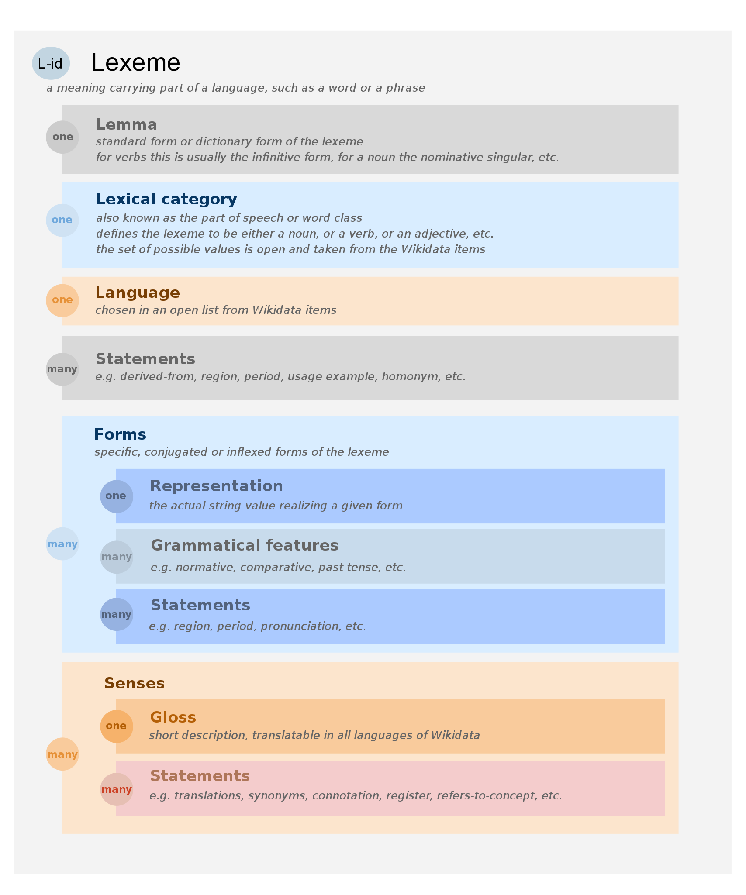

# WIKIDATA PARSE

Simple Parser to convert the wikidata lexemes files from json to sqlite.

Each Lexeme is accessible at wikidata like so: https://www.wikidata.org/wiki/Lexeme:L1913
The same is possible with properties: https://www.wikidata.org/wiki/Property:P6

## Install

```shell
poetry install
```

## Get Properties List from wikidata
Run the query: https://query.wikidata.org/#SELECT%20%3Fproperty%20%3FpropertyType%20%3FpropertyLabel%20%3FpropertyDescription%20%3FpropertyAltLabel%20WHERE%20%7B%0A%20%20%20%20%3Fproperty%20a%20wikibase%3AProperty%20.%0A%20%20%20%20SERVICE%20wikibase%3Alabel%20%7B%0A%20%20%20%20%20%20bd%3AserviceParam%20wikibase%3Alanguage%20%22en%22%20.%0A%20%20%20%7D%0A%20%7D%0A%0A
Download the file as json.

## Format source

Claims <=> Statements


https://www.mediawiki.org/wiki/Extension:WikibaseLexeme/Data_Model
https://doc.wikimedia.org/Wikibase/master/php/docs_topics_json.html


## Behavior

Some type of claims are skipped: media, time, quantity, ...

## Source file

Download lexeme file at: [https://dumps.wikimedia.org/wikidatawiki/entities/](https://dumps.wikimedia.org/wikidatawiki/entities/)

